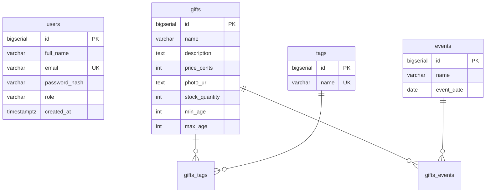

# Gift Selection Catalog

Бекенд для сервісу підбору подарунків. Фільтрація за ціною, віком, тегами та подіями. JWT-авторизація, особистий кабінет, адмін-панель.

## Як запустити

```bash
docker compose -f backend/compose.yaml up -d
cd backend
./mvnw spring-boot:run
```

Swagger: http://localhost:8080/api/swagger-ui.html

## Ролі

- `USER` — створюється при реєстрації, може переглядати каталог і редагувати свій профіль
- `ADMIN` — має доступ до CRUD подарунків через `/admin/gifts`


## Ендпоінти

| Метод | URL | Хто має доступ |
|-------|-----|----------------|
| POST | `/api/auth/register` | всі |
| POST | `/api/auth/login` | всі |
| GET | `/api/profile` | авторизований |
| PUT | `/api/profile` | авторизований |
| GET | `/api/gifts` | всі |
| GET | `/api/gifts/{id}` | всі |
| POST | `/api/admin/gifts` | ADMIN |
| PUT | `/api/admin/gifts/{id}` | ADMIN |
| DELETE | `/api/admin/gifts/{id}` | ADMIN |

Фільтри для `GET /api/gifts`: `q`, `priceMinCents`, `priceMaxCents`, `age`, `tags`

## Схема БД



## Стек

Java 17, Spring Boot 4, Spring Security (JWT), Spring Data JPA, PostgreSQL, Flyway, MapStruct, Lombok, Springdoc OpenAPI
