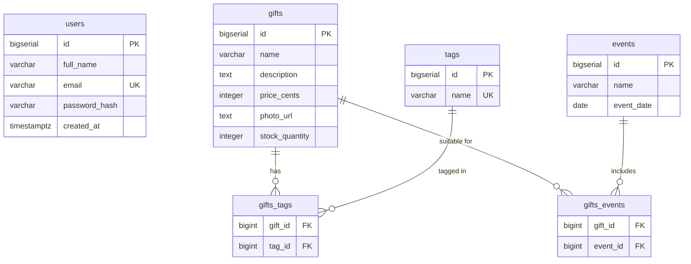

# Gift Selection Catalog

Сервіс підбору подарунків з каталогом, фільтрацією за тегами/подіями та особистим кабінетом.

## Запуск

```bash
# 1. Підняти PostgreSQL
docker compose -f backend/compose.yaml up -d

# 2. Запустити бекенд
cd backend
./mvnw spring-boot:run
```

Swagger UI: [http://localhost:8080/api/swagger-ui.html](http://localhost:8080/api/swagger-ui.html)

## API

| Метод | Endpoint | Доступ | Опис |
|-------|----------|--------|------|
| POST | `/api/auth/register` | public | Реєстрація |
| POST | `/api/auth/login` | public | Логін |
| GET | `/api/profile` | JWT | Профіль користувача |
| PUT | `/api/profile` | JWT | Оновити ПІБ |
| GET | `/api/gifts` | public | Пошук/фільтрація подарунків |
| GET | `/api/gifts/{id}` | public | Подарунок за ID |
| POST | `/api/admin/gifts` | JWT | Створити подарунок |
| PUT | `/api/admin/gifts/{id}` | JWT | Оновити подарунок |
| DELETE | `/api/admin/gifts/{id}` | JWT | Видалити подарунок |

## ER-діаграма



## Технології

- Java 17, Spring Boot 4, Spring Security (JWT), Spring Data JPA
- PostgreSQL, Flyway (міграції)
- MapStruct (маппінг), Lombok
- Springdoc OpenAPI (Swagger UI)
